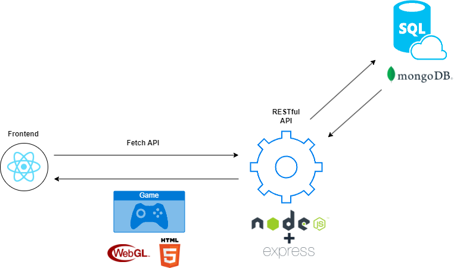
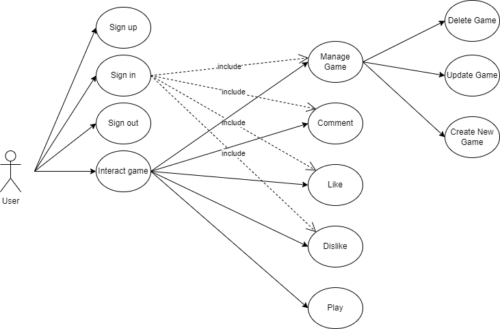
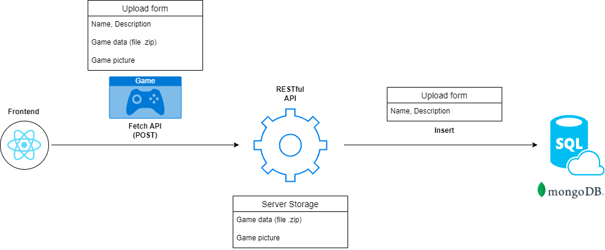
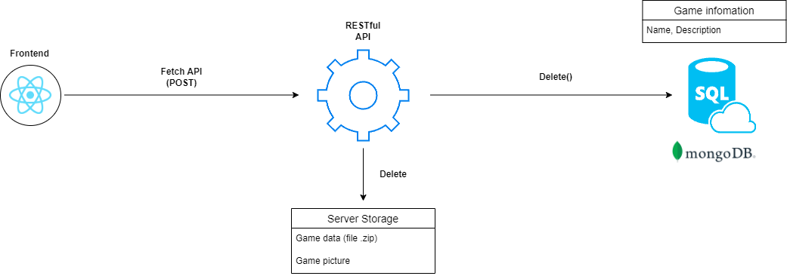
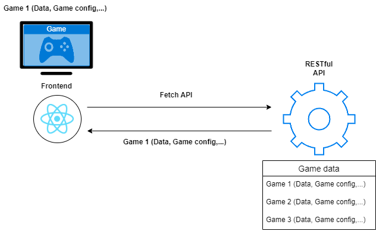
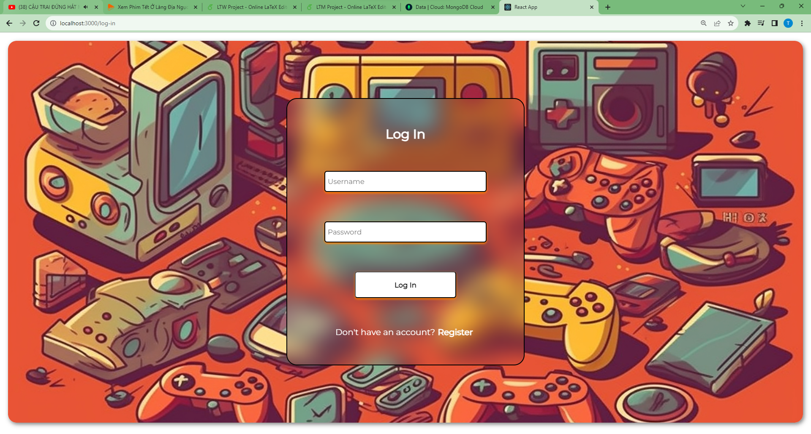
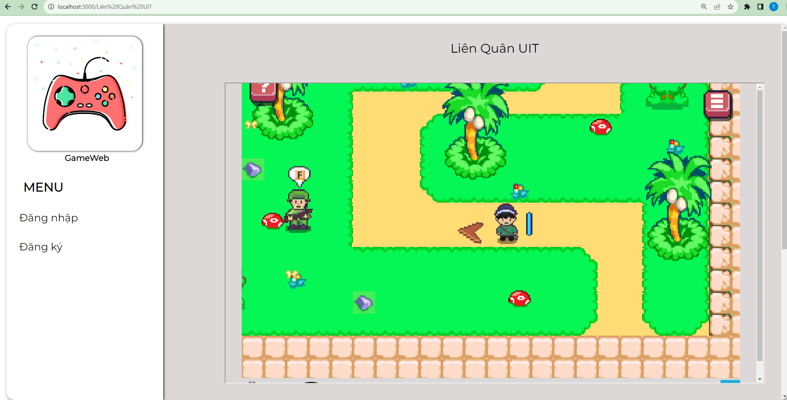

 <h1 align="center">Gaming Share Game</h1>

## Overview
Trang web được xây dựng gồm 2 phần Front end được xây dựng bằng ReactJS và phần Backend sử dụng RESTful API cho phép phần Frontend sử dụng thông qua API.

## Usecase
Các chức năng và tiêu chí dành cho khách hàng bao gồm khách hàng chưa đăng ký tài khoản:

• Giao diện dễ sử dụng và tính thẩm mỹ cao.

• Cho phép khách hàng đăng ký thành viên và đảm bảo bí mật (mã hóa mật khẩu) thông tin.

• Xem và tương tác với các trò chơi được đăng tải.

• Tìm kiếm các trò chơi thông qua tên trò chơi.

• Thông tin trò chơi đầy đủ.

• Hiển thị các đánh giá trò chơi từ cộng đồng.

• Xem và thay đổi thông tin tài khoản.

  Ngoài các yêu cầu giống như khách hàng, thì hệ thống phải đảm bảo các yêu cầu sau của người quản trị:

• Đăng tải thông tin và tựa game đến cộng đồng

• Dễ dàng cập nhật và thay đổi thông tin các trò chơi của tác giả.

• Có thể tham gia đánh giá các trò chơi của người khác.

• Xem và thống kê thông tin của các trò chơi đã đăng tải

## Workflow
### Upload Game flow

### Delete Game flow 

### Play Game flow

### Delete Game flow 

### Play Game flow

## About Website

